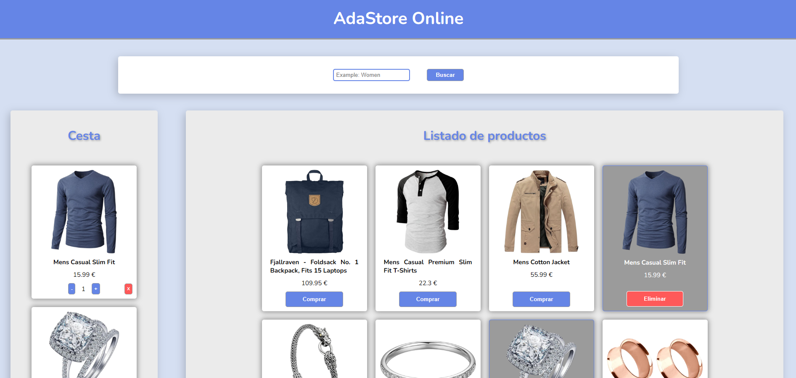

# 🌟 **AdaStore – Mini tienda online**

  

---

## 🛍️ **Descripción**

AdaStore es una pequeña tienda online demostrativa que permite:

- 🖼️ Visualizar una lista de productos con imagen, precio y título
- 🔎 Buscarlos por texto en tiempo real
- 🛒 Añadirlos al carrito y gestionar cantidades
- 💾 Mantener el carrito guardado gracias a **localStorage**

---

## 🌐 **Demo online**

👉 **https://beta.adalab.es/modulo-2-evaluacion-final-JenniferRomanMuerte/**

---

## ✨ **Funcionalidades principales**

### 📦 Productos
- Render dinámico de productos obtenidos de FakeStore API
- Tarjetas con imagen, título, precio y botón
- Marcado visual cuando un producto está en el carrito

### 🔍 Búsqueda
- Filtro en tiempo real (insensible a mayúsculas/minúsculas)
- Mensaje automático cuando no existen resultados
- Botón **"Volver"** para restablecer la lista

### 🛒 Carrito de compra
- Incrementar y decrementar cantidades
- Eliminar un elemento o vaciar el carrito completo
- Guardado en `localStorage`
- Cambio automático del layout cuando el carrito está vacío

---

## 🧩 **Estructura del proyecto**

### 🗂️ Partials HTML

/partials
├─ header.html
├─ footer.html
├─ main.html
└─ sections
├─ productList.html
├─ searchProducts.html
└─ shoppingCart.html

Cada partial contiene solo su bloque, facilitando la lectura y el mantenimiento.

---

## 🧠 **JavaScript**

### 📌 `main.js`
- Punto de entrada
- Petición a la API
- Arranque del render inicial

### 📦 `productList.js`
- Render de la lista de productos
- Creación de tarjetas dinámicas
- Cambiar estilos si están en el carrito
- Lógica del botón *Comprar / Eliminar*

### 🔎 `searchProducts.js`
- Filtro por texto
- Control de resultados vacíos
- Botón de restablecimiento de lista

### 🛒 `shoppingCart.js`
- Render del carrito
- Incrementar/decrementar cantidad
- Eliminar productos
- Vaciar carrito
- Sincronización con localStorage
- Control del layout principal (`noCart`)

---

## 🎨 **SCSS modular**

| Archivo | Función |
|--------|---------|
| **`_variables.scss`** | Colores, sombras, tipografías, pesos |
| **`_mixins.scss`** | Mixins para botones, hover y layouts |
| **`_main.scss`** | Estilos del grid principal y del estado `noCart` |
| **Componentes** | Estilos separados por secciones |

### Estructura de SCSS

/scss
├─ core
│ ├─ _variables.scss
│ ├─ _mixins.scss
├─ layout
│ ├─ _main.scss
│ ├─ _header.scss
│ └─ _footer.scss
└─ components
├─ _productList.scss
├─ _search.scss
└─ _shoppingCart.scss

---

## 💾 **Persistencia del carrito**

- Estado guardado automáticamente en `localStorage`
- Recuperación del carrito al recargar la página
- Vista totalmente sincronizada con la lógica del almacenamiento
- Adaptación automática del layout según haya o no productos

---

